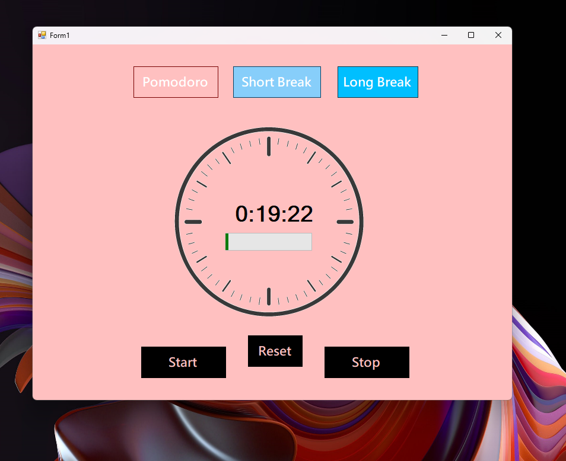
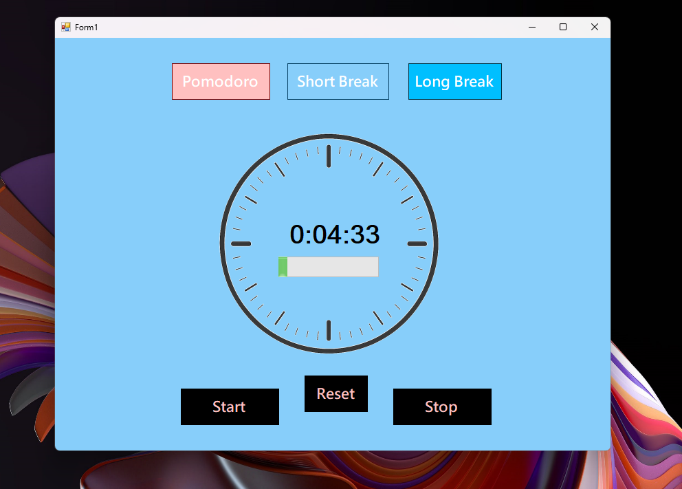
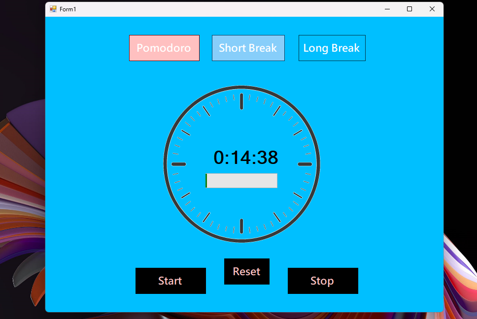

# My Pomodoro Timer

## 📌 Project Overview

My Pomodoro Timer is a Windows Forms desktop application based on the Pomodoro Technique.

The system helps users improve productivity by breaking work into intervals (25 minutes) separated by short breaks (5 minutes), with longer breaks (15-30 minutes) after every four Pomodoros.

This project was built as part of practical training while studying desktop application development.

---

## 🏗 System Architecture

This is a **Single Tier Architecture** application:
1. **Presentation Layer**
   * Windows Forms UI
   * Timer display
   * Mode switching controls
2. **Application Logic**
   * Timer management
   * Mode logic (Pomodoro, Short Break, Long Break)
   * State tracking
3. **Data Storage**
   * None (client-side timer)
   * Configuration settings

---

## 🛠 Technologies Used

* C#
* .NET Framework – Windows Forms
* Timer control
* Visual Studio

---

## ✨ System Features

### ⏰ Timer Modes

* **Pomodoro Mode**: 25 minutes focused work
* **Short Break**: 5 minutes break
* **Long Break**: 15-30 minutes break

### 📊 Time Tracking

* Visual timer display
* Countdown progress
* Time remaining indicator

### 🔔 Notifications

* Break reminders
* Timer completion alerts
* Automatic mode switching

---

## 📷 Screenshots

### 🍅 Pomodoro Mode



### ☕ Short Break Mode



### 🌴 Long Break Mode



---

## ⚙️ Installation & Setup

1️⃣ Clone the repository

```bash
git clone https://github.com/ss24214859/My-Pomodoro.git
```

2️⃣ Open the solution file in Visual Studio.

3️⃣ Build and run the project.

4️⃣ Start your Pomodoro session!

---

## 🚀 Future Enhancements

* Statistics tracking (completed Pomodoros, total work time)
* Task list integration
* Sounds for timer completion
* Customizable timer durations
* Export progress reports
* Multiple timers support
* Desktop notifications

---

## 👨‍💻 Author

**Mohamed Shaaban**

* GitHub: [https://github.com/ss24214859](https://github.com/ss24214859)

---

## 📜 License

This project is for learning purposes and training.
